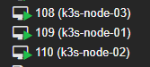
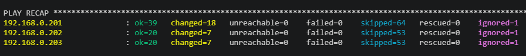
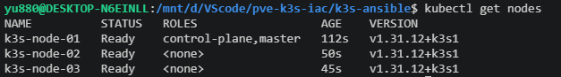

# PVE + k3s IaC Lab

使用 Terraform 在 Proxmox VE 上自動建立虛擬機，再透過 Ansible 部署 k3s Kubernetes 叢集。

## 架構

```
Windows 主機 (控制端)
├── Terraform      → 建立 / 刪除 Proxmox VM
└── WSL Ubuntu     → 執行 Ansible，SSH 連入 VM 部署 k3s

Proxmox VE (192.168.0.254)
├── k3s-node-01 (192.168.0.201)  → k3s server
├── k3s-node-02 (192.168.0.202)  → k3s agent
└── k3s-node-03 (192.168.0.203)  → k3s agent
```

## 前置

- Proxmox VE 已建好 VM 模板（ID 9000，Ubuntu cloud image）
- Windows 已安裝 Terraform
- Windows 已安裝 WSL2 + Ubuntu
- 控制端 SSH 公鑰已填入 `main.tf`

---

## 部署流程

### 1. 建立虛擬機（Terraform）

在 PowerShell 執行：

```powershell
cd D:\VScode\pve-k3s-iac
terraform init   
terraform apply
```

輸入 `yes` 確認。


### 2. 安裝 Ansible

```bash
sudo apt update && sudo apt install -y software-properties-common
sudo add-apt-repository --yes --update ppa:ansible/ansible
sudo apt install -y ansible
ansible-galaxy collection install -r collections/requirements.yml
```

### 3. 設定 SSH 金鑰

```bash
mkdir -p ~/.ssh
cp /mnt/c/Users/yu880/.ssh/id_rsa ~/.ssh/id_rsa
chmod 600 ~/.ssh/id_rsa
```

### 4. 部署 k3s（Ansible）

```bash
cd /mnt/d/VScode/pve-k3s-iac/k3s-ansible
ANSIBLE_ROLES_PATH=./roles ANSIBLE_HOST_KEY_CHECKING=False ansible-playbook -i inventory.yml playbooks/site.yml --private-key ~/.ssh/id_rsa
```


### 5. 驗證

```bash
ssh -i ~/.ssh/id_rsa ubuntu@192.168.0.201 "sudo kubectl get nodes"
```

預期輸出：

```
NAME          STATUS   ROLES                  AGE   VERSION
k3s-node-01   Ready    control-plane,master   ...   v1.31.12+k3s1
k3s-node-02   Ready    <none>                 ...   v1.31.12+k3s1
k3s-node-03   Ready    <none>                 ...   v1.31.12+k3s1
```

### 6. 將本地（WSL）與叢集連線
```
# 1. 在本地建立 .kube 資料夾
mkdir -p ~/.kube

# 2. 從遠端 Master 節點複製 kubeconfig 檔案過來
ssh -i ~/.ssh/id_rsa ubuntu@192.168.0.201 "sudo cat /etc/rancher/k3s/k3s.yaml" > ~/.kube/config

# 3. 修改權限，保護憑證
chmod 600 ~/.kube/config

# 4. 將設定檔中的 127.0.0.1 改為 Master 的真實 IP
# (在 Linux/WSL 上執行這行)
sed -i 's/127.0.0.1/192.168.0.201/g' ~/.kube/config
```

---

## 刪除與重建

```powershell
# 刪除全部 VM
terraform destroy
```

重建時，清除舊的 SSH host key 再跑一次：

```bash
# WSL Ubuntu
ssh-keygen -R 192.168.0.201
ssh-keygen -R 192.168.0.202
ssh-keygen -R 192.168.0.203

# 重新部署
cd /mnt/d/VScode/pve-k3s-iac/k3s-ansible
ANSIBLE_ROLES_PATH=./roles ANSIBLE_HOST_KEY_CHECKING=False ansible-playbook -i inventory.yml playbooks/site.yml --private-key ~/.ssh/id_rsa
```

---

## 注意事項

- **WSL 預設發行版**：系統有 Docker Desktop 和 Ubuntu 兩個 WSL 發行版，需指定 `-d Ubuntu` 或直接在 Ubuntu 視窗執行。
- **ansible.cfg 被忽略**：因為專案在 Windows 掛載目錄（`/mnt/d/`），Ansible 視為 world-writable 而忽略 `ansible.cfg`，因此需在指令中手動帶入環境變數 `ANSIBLE_ROLES_PATH` 和 `ANSIBLE_HOST_KEY_CHECKING`。
- **SSH 金鑰**：WSL 重啟後 `~/.ssh/id_rsa` 不會消失，但若 Ubuntu 重新安裝則需重新複製。
